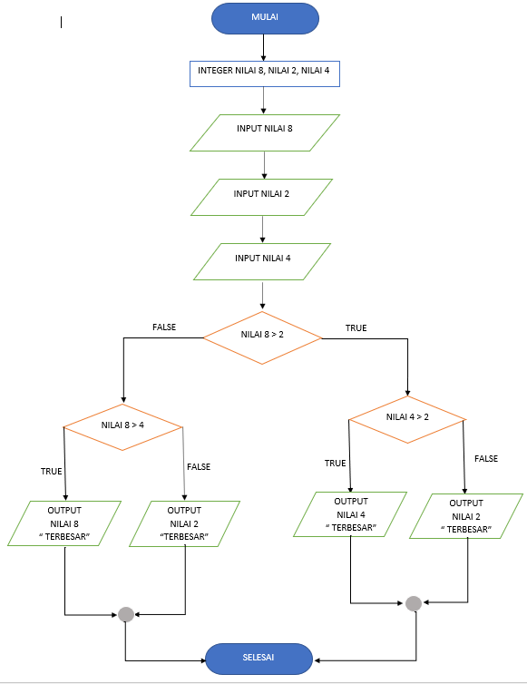

# LABPY02

## SOAL

## jawab

untuk menjawab soal tersebut saya membuat inputan nilai terlebih dahulu

    a = int(input("Masukkan bilangan 1: "))
    b = int(input("Masukkan bilangan 2: "))
    c = int(input("Masukkan bilangan 3: "))

lalu masukan angka yang diinginkan

saya memasukan bilangan 1 : 8 bilangan 2 : 2 bilangan 3 : 4

## FLOWCHART

untuk mengerjakan bisa menggunakan syntax di bawah ini :

    import random
    print(40*"=")
    print("Bilangan acak yang lebih kecil dari 0,5")
    print(40*"=")
    jum = int( input("Masukan nilai n : "))
    i = 0
    for i in range(jum):
        i += 1
        angkaDec = random.uniform(0, 0.5)
        print("Data ke", i, " = ", angkaDec)

## OUTPUT

dan di bawah ini adalah outputya :

